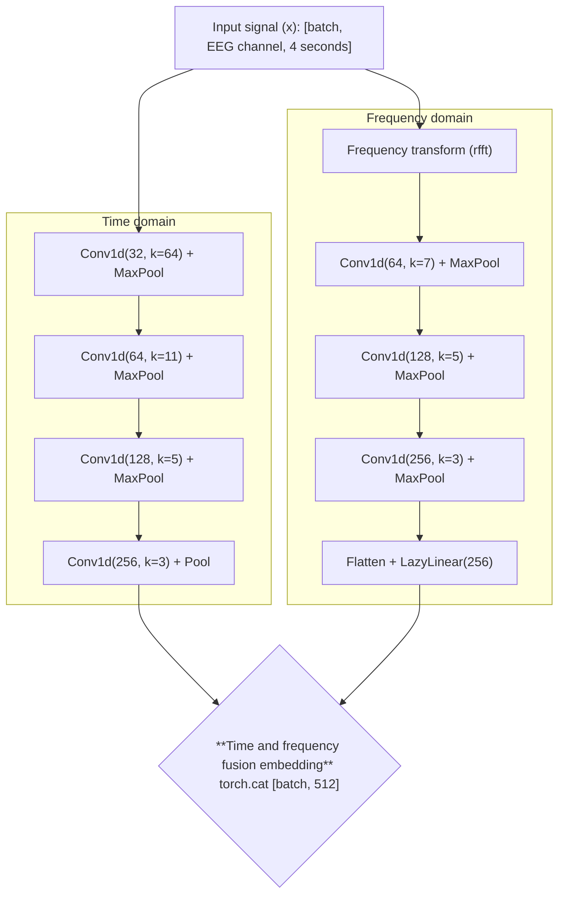

```mermaid
graph TD
    Input["Input signal (x): [batch, EEG channel, 4 seconds]"]

    subgraph Time domain
        T1["Conv1d(32, k=64) + MaxPool"]
        T2["Conv1d(64, k=11) + MaxPool"]
        T3["Conv1d(128, k=5) + MaxPool"]
        T4["Conv1d(256, k=3) + Pool"]
        T1 --> T2 --> T3 --> T4
    end

    subgraph Frequency domain
        F_Trans["Frequency transform (rfft)"]
        F1["Conv1d(64, k=7) + MaxPool"]
        F2["Conv1d(128, k=5) + MaxPool"]
        F3["Conv1d(256, k=3) + MaxPool"]
        F_Flat["Flatten + LazyLinear(256)"]
        F_Trans --> F1 --> F2 --> F3 --> F_Flat
    end

    Input --> T1
    Input --> F_Trans

    Fusion{"**Time and frequency fusion embedding** torch.cat [batch, 512]"}
    T4 --> Fusion
    F_Flat --> Fusion
```